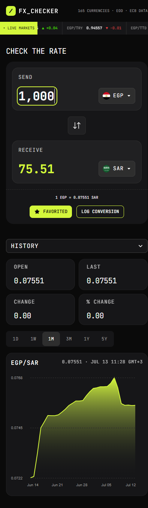
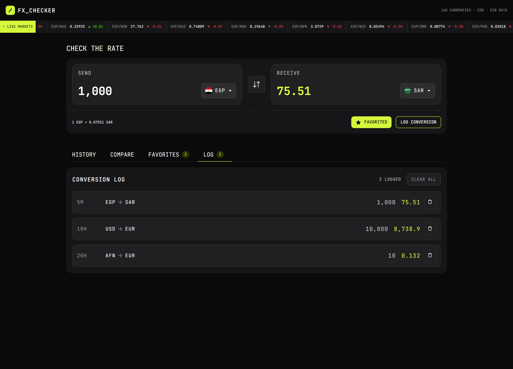

# Frontend Mentor - FX Checker solution

This is a solution to the [FX Checker challenge on Frontend Mentor](https://www.frontendmentor.io/challenges/foreign-exchange-currency-converter). Frontend Mentor challenges help you improve your coding skills by building realistic projects.

## Table of contents

- [Overview](#overview)
  - [The challenge](#the-challenge)
  - [Screenshot](#screenshot)
  - [Links](#links)
- [My process](#my-process)
  - [Built with](#built-with)
  - [What I learned](#what-i-learned)
  - [Continued development](#continued-development)
  - [Useful resources](#useful-resources)
  - [AI Collaboration](#ai-collaboration)
- [Acknowledgments](#acknowledgments)

**Note: Delete this note and update the table of contents based on what sections you keep.**

## Overview

### The challenge

Your users should be able to:

#### Converter

- Enter an amount to send and see it convert in real time as they type
- Pick the "send" and "receive" currencies from a searchable currency picker
- See the live exchange rate for the active pair (for example, `1 USD = 0.8530 EUR`)
- Swap the send and receive currencies with the swap button
- Favorite the active pair, and log a conversion to their history

#### Currency picker

- Search the full list of available currencies by code or name
- See currencies grouped into "Popular" and "Other currencies", each row showing the flag, code, and name
- See a check against the currency that's currently selected

#### Live markets ticker

- See a ticker of currency pairs, each with its current rate and 24-hour change (up or down)

#### Rate history

- View a line and area chart of the active pair's rate over time
- Switch the chart range between 1D, 1W, 1M, 3M, 1Y, and 5Y
- See the open, last, absolute change, and percentage change for the selected range

#### Compare

- See their send amount converted into a range of other currencies at once, each with its reference rate
- Pin or unpin any comparison row to their favorites

#### Favorites

- See their pinned pairs, each with its live rate and 24-hour change
- Load a pinned pair back into the converter by selecting its row
- Unpin a pair they no longer want to track

#### Conversion log

- See a log of conversions they've made, each showing the relative time, the pair, and the send and receive amounts
- Clear the whole log
- Delete an individual entry

#### UI & accessibility

- View the optimal layout for the interface depending on their device's screen size
- See hover and focus states for all interactive elements on the page
- Navigate the entire app using only their keyboard

### Screenshot

### Links

- Solution URL: [Add solution URL here](https://your-solution-url.com)
- Live Site URL: [FX checker](https://foreign-exchange-checker-ten.vercel.app/)

## My process

### Built with

- Semantic HTML5 markup
- CSS custom properties
- Flexbox
- CSS Grid
- Mobile-first workflow
- [React](https://reactjs.org/) - JS library
- [React Router](https://reactrouter.com/home) - React framework
- [React Aria](https://react-aria.adobe.com/) - For UI components
- [D3.js] (https://d3js.org/) - For Chart

### What I learned

I learned a lot. I learned about server rendering. I got more familiar with TypeScript. I used a component library for the first time. And ofcourse when I see a chart in the future, I wouldn't be intimidated but it's still hard.

### Continued development

- I would like to learn more about State management. Making decisions about where to put state, e.g. local to a component vs in a context vs a server loader
- I also want to learn more about organizing files and how to group different pieces of the project for easier maintainability

### Useful resources

- [Storing data in React Router](https://reactrouter.com/explanation/state-management#state-management) - This helped me understand the different options I have for storing data with their pros and cons.
- [Infinite horizontal scroller](https://www.youtube.com/watch?v=KD1Yo8a_Qis) - I used this to learn how to make the scroller for the live market banner using CSS, JS.
- [Generics in TypeScript](https://www.typescriptlang.org/docs/handbook/2/generics.html#handbook-content) I was using generics without really understanding them, e.g. with React `useState`. This article helped me understand how they are used and why we need them.

### AI Collaboration

I used GitHub Copilot for debugging problems and explaining what I don't understand. And used Gemini to lookup things that I don't know how to implement.

## Acknowledgments

I would like to thank everyone on the FEM Discord server who answered my questions.
